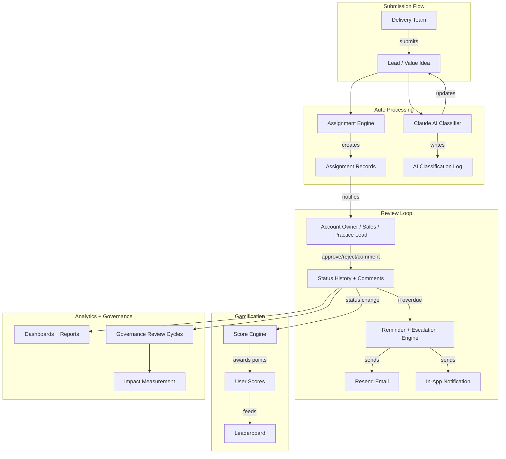

# Value Portal — Full Implementation Plan

## Tech Stack Summary

- **Framework**: Next.js 14 (App Router) — frontend + API routes in one repo
- **Database + Auth**: Supabase (PostgreSQL, Row-Level Security, built-in Auth)
- **Styling**: Tailwind CSS + shadcn/ui (forms, tables, modals, toasts)
- **AI**: Claude API (Anthropic) — classification, summarization, pattern detection
- **Email**: Resend — reminders, escalations, status updates
- **Deploy**: Vercel — auto-deploy from GitHub

---

## Project Structure

```
value-portal/
├── app/
│   ├── (auth)/
│   │   ├── login/page.tsx
│   │   ├── register/page.tsx
│   │   └── layout.tsx
│   ├── (dashboard)/
│   │   ├── layout.tsx                  # Sidebar + topbar shell
│   │   ├── page.tsx                    # Home dashboard
│   │   ├── accounts/
│   │   │   ├── page.tsx                # Account list
│   │   │   ├── [id]/page.tsx           # Account detail
│   │   │   └── new/page.tsx            # Create account
│   │   ├── leads/
│   │   │   ├── page.tsx                # Lead list with filters
│   │   │   ├── [id]/page.tsx           # Lead detail + comments
│   │   │   └── new/page.tsx            # Submit lead form
│   │   ├── ideas/
│   │   │   ├── page.tsx                # Idea list with filters
│   │   │   ├── [id]/page.tsx           # Idea detail + comments
│   │   │   └── new/page.tsx            # Submit idea form
│   │   ├── assignments/page.tsx        # My assignments queue
│   │   ├── leaderboard/page.tsx        # Rankings + badges
│   │   ├── reports/page.tsx            # Dashboards + export
│   │   ├── reviews/page.tsx            # Governance cycles
│   │   ├── admin/
│   │   │   ├── users/page.tsx          # User management
│   │   │   ├── routing-rules/page.tsx  # Assignment rules
│   │   │   └── escalation-rules/page.tsx
│   │   └── notifications/page.tsx      # Notification center
│   ├── api/
│   │   ├── leads/route.ts
│   │   ├── ideas/route.ts
│   │   ├── assignments/route.ts
│   │   ├── ai/classify/route.ts
│   │   ├── notifications/route.ts
│   │   ├── scores/route.ts
│   │   ├── leaderboard/route.ts
│   │   ├── reports/route.ts
│   │   ├── reviews/route.ts
│   │   └── cron/
│   │       ├── reminders/route.ts      # Vercel cron for reminders
│   │       └── leaderboard/route.ts    # Vercel cron for rank calc
│   └── layout.tsx                      # Root layout
├── components/
│   ├── ui/                             # shadcn components (auto-generated)
│   ├── layout/
│   │   ├── sidebar.tsx
│   │   ├── topbar.tsx
│   │   └── mobile-nav.tsx
│   ├── leads/
│   │   ├── lead-form.tsx
│   │   ├── lead-card.tsx
│   │   └── lead-table.tsx
│   ├── ideas/
│   │   ├── idea-form.tsx
│   │   ├── idea-card.tsx
│   │   └── idea-table.tsx
│   ├── shared/
│   │   ├── status-badge.tsx
│   │   ├── comment-thread.tsx
│   │   ├── file-upload.tsx
│   │   ├── status-timeline.tsx
│   │   └── score-display.tsx
│   └── dashboard/
│       ├── stats-cards.tsx
│       ├── charts.tsx
│       └── recent-activity.tsx
├── lib/
│   ├── supabase/
│   │   ├── client.ts                   # Browser client
│   │   ├── server.ts                   # Server client
│   │   ├── admin.ts                    # Service-role client
│   │   └── middleware.ts               # Auth middleware
│   ├── ai/
│   │   └── classifier.ts              # Claude API integration
│   ├── email/
│   │   └── resend.ts                   # Resend integration
│   ├── scoring.ts                      # Points calculation logic
│   ├── assignment.ts                   # Routing rule engine
│   └── utils.ts
├── types/
│   └── index.ts                        # All TypeScript interfaces
├── supabase/
│   └── migrations/
│       ├── 001_auth_profiles.sql
│       ├── 002_accounts.sql
│       ├── 003_leads.sql
│       ├── 004_ideas.sql
│       ├── 005_assignments.sql
│       ├── 006_notifications.sql
│       ├── 007_tracking.sql
│       ├── 008_scoring.sql
│       ├── 009_leaderboard.sql
│       ├── 010_ai_logs.sql
│       ├── 011_dashboard_metrics.sql
│       └── 012_governance.sql
├── middleware.ts                        # Next.js middleware (auth guard)
├── tailwind.config.ts
├── next.config.js
├── package.json
└── .env.local
```

---

## Implementation Steps

### Step 0 — Project Scaffolding

Set up the repo, install all dependencies, configure Supabase and Tailwind, create the root layout and auth middleware shell.

**What gets done:**

- `npx create-next-app@14` with TypeScript, Tailwind, App Router
- Install shadcn/ui and initialize components (button, input, form, table, dialog, toast, select, tabs, card, badge, dropdown-menu, avatar, sheet)
- Create Supabase project, grab keys, configure `.env.local`
- Set up `lib/supabase/client.ts`, `lib/supabase/server.ts`
- Create `middleware.ts` for route protection
- Build the dashboard shell layout (sidebar + topbar)
- Define all TypeScript interfaces in `types/index.ts`

**Outcome:** Empty app with auth-guarded routes, navigation shell, and a working dark-themed UI skeleton.

---

### Step 1 — Auth and User Management (M1) + Account Master (M2)

**Database:**

- Migration `001_auth_profiles.sql`: `profiles` table extending Supabase Auth (role, department, account_assigned, profile_photo, is_active) with RLS policies
- Migration `002_accounts.sql`: `accounts` table with all fields from blueprint, RLS policies

**Pages:**

- `/login` and `/register` using Supabase Auth (email/password)
- `/admin/users` — user list, role assignment, activate/deactivate
- `/accounts` — account list with search/filter by region, industry, status
- `/accounts/new` — create account form
- `/accounts/[id]` — account detail with ownership info

**Key logic:**

- Supabase Auth trigger to auto-create profile row on signup
- Role-based middleware — check `role` from profiles table and restrict routes
- RLS policies: users see only their assigned accounts unless Admin/Executive

**Outcome:** Working login, role-based access, account CRUD.

---

### Step 2 — Lead Submission (M3) + Value Idea Submission (M4)

**Database:**

- Migration `003_leads.sql`: `leads` table with all fields, RLS
- Migration `004_ideas.sql`: `value_ideas` table with all fields, RLS

**Pages:**

- `/leads/new` — multi-step form (title, description, type, account, estimated value, probability, priority, file upload)
- `/leads` — table view with filters (status, type, account, priority), search, sort
- `/leads/[id]` — detail view with status badge, AI tags, timeline
- `/ideas/new` — form (problem statement, proposed solution, category, estimated saving, effort, timeline, impact areas, tools)
- `/ideas` — table view with filters
- `/ideas/[id]` — detail view

**Key logic:**

- Draft save (auto-save before submit)
- File upload to Supabase Storage
- Status transitions: Draft -> Submitted -> Under Review -> ...
- On submit, trigger assignment engine (Step 3) and AI classification (Step 4)

**Outcome:** Users can submit leads and ideas with full forms, view them in filtered lists.

---

### Step 3 — Assignment Engine (M5) + Tracking (M7)

**Database:**

- Migration `005_assignments.sql`: `assignments` table + `routing_rules` table
- Migration `007_tracking.sql`: `status_history` table + `comments` table

**Pages:**

- `/assignments` — "My Queue" view showing pending assignments for current user
- Assignment actions on lead/idea detail pages (approve, reject, escalate, comment)
- `/admin/routing-rules` — CRUD for routing rules
- Comment thread component on every lead/idea detail page
- Status timeline component showing full history

**Key logic:**

- `lib/assignment.ts` — when a submission is created:
  1. Look up the account's `account_owner_id`, `sales_lead_id`, `practice_leader_id`
  2. Check `routing_rules` for matching trigger conditions
  3. Create assignment rows for each stakeholder
- Every status change writes to `status_history`
- Comments support `is_internal` flag for internal-only notes

**Outcome:** Submissions auto-route to the right people, full audit trail, comment threads work.

---

### Step 4 — AI Classification (M10) + Reminders (M6)

**Database:**

- Migration `010_ai_logs.sql`: `ai_classification_logs` + `pattern_insights`
- Migration `006_notifications.sql`: `notifications` + `escalation_rules`

**API Routes:**

- `/api/ai/classify` — sends submission text to Claude, stores classification result
- `/api/cron/reminders` — Vercel cron job (daily) checking for overdue assignments
- `/api/notifications` — mark as read, list notifications

**Pages:**

- `/notifications` — notification center (in-app notifications list)
- Bell icon in topbar with unread count (Supabase real-time subscription)
- `/admin/escalation-rules` — configure SLA thresholds

**Key logic:**

- `lib/ai/classifier.ts`:
  - Sends title + description + category to Claude claude-sonnet-4-6
  - Returns: `assigned_category`, `confidence_score`, `ai_summary`, `suggested_assignees`
  - Results stored in `ai_classification_logs`
  - Lead/idea rows updated with `ai_category`, `ai_confidence`, `ai_summary`
- `lib/email/resend.ts`:
  - Reminder email template
  - Escalation email template
- Cron job logic: query assignments where `action_taken = 'Pending'` and `assignment_date + trigger_days < now()`

**Outcome:** Every submission gets AI-classified on creation, overdue items trigger email reminders and escalations.

---

### Step 5 — Scoring (M8) + Leaderboard (M9)

**Database:**

- Migration `008_scoring.sql`: `score_events` + `user_scores`
- Migration `009_leaderboard.sql`: `leaderboard_entries`

**Pages:**

- `/leaderboard` — rankings by category (Top Contributor, Revenue Leader, Value Champion), filterable by period (Monthly, Quarterly, Annual)
- Score display on user profile / sidebar
- Points breakdown on lead/idea detail pages

**Key logic:**

- `lib/scoring.ts` — point awards triggered by status changes:
  - Submitted: 5 pts
  - Approved: 10 pts
  - Qualified (lead): 25 pts
  - Implemented (idea): 30 pts
  - Deal Won: 100+ pts (proportional to deal value)
- `/api/cron/leaderboard` — weekly cron recalculates `user_scores` aggregates and `leaderboard_entries` rankings
- Badge assignment based on thresholds

**Outcome:** Gamification loop is live — users earn points, see rankings, compete.

---

### Step 6 — Dashboards (M11) + Governance (M12)

**Database:**

- Migration `011_dashboard_metrics.sql`: `dashboard_metrics` + `reports`
- Migration `012_governance.sql`: `review_cycles` + `impact_measurements`

**Pages:**

- `/` (home dashboard):
  - Stats cards: total leads, total ideas, revenue influenced, cost saved
  - Charts: submissions over time, status distribution, top accounts
  - Recent activity feed
  - Role-specific views (DM sees their submissions, Executive sees org-wide)
- `/reports` — generate/export reports (PDF, Excel, CSV)
- `/reviews` — review cycle management (create cycle, assign submissions, track progress)
- Impact measurement form on closed leads/ideas (revenue influenced, cost saved, efficiency gain)

**Key logic:**

- Dashboard metrics computed via Supabase SQL views / functions
- Report export using server-side generation
- Review cycles with status tracking (Planned -> In Progress -> Completed)

**Outcome:** Full analytics, executive dashboards, governance review cycles, and impact measurement.

---

## Data Flow Diagram




## Estimated Effort Per Step

- **Step 0** — Scaffolding: ~0.5 day
- **Step 1** — Auth + Accounts: ~1 day
- **Step 2** — Leads + Ideas: ~1.5 days
- **Step 3** — Assignments + Tracking: ~1 day
- **Step 4** — AI + Reminders: ~1 day
- **Step 5** — Scoring + Leaderboard: ~0.5 day
- **Step 6** — Dashboards + Governance: ~1.5 days

**Total: ~7 working days** (with Cursor accelerating most of the boilerplate)